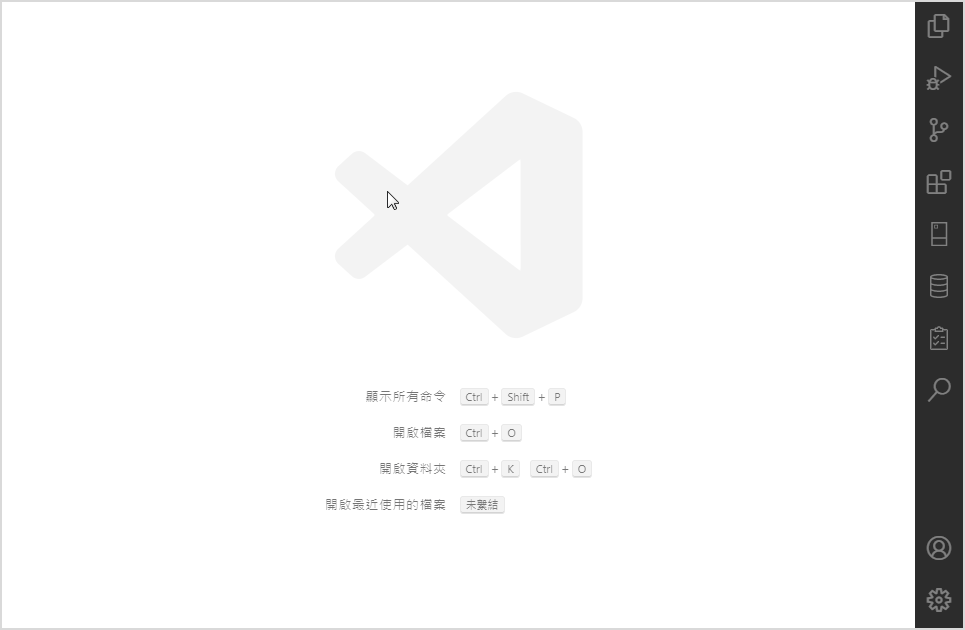

# Flow Visualizer

* 本延伸模組提供VS Code將程式碼邏輯流程可視化的功能。

### Version 0.0.1

目前僅支援JavaScript語法。
目前僅支援if-else、switch、for-loop、for-in-loop、for-of-loop、do-while-loop、while-loop、try-catch-finally敘述。
目前不支援async/await關鍵字。
目前不支援class敘述。
目前不支援VS Code深色及高對比主題。
確定不支援with敘述。
確定不支援label敘述。

## 安裝

* 在**延伸模組: 市集**搜尋**flow visualizer**並安裝本延伸模組。

## 使用方法

* 第一步：打開編輯器視窗，輸入JavaScript語法。
* 第二步：點擊編輯器視窗右上方的**Generate flow block**按鈕。
* 第三步：流程可視化視窗將會顯示在編輯器視窗的右側。

